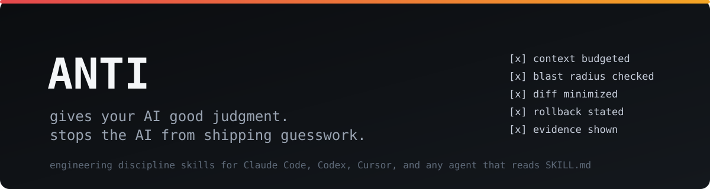

<p align="center">
  
</p>

# AntiSkill

*The Anti-Slop Engineering Framework for AI Agents*

**Portable [Agent Skills](https://github.com/vercel-labs/agent-skills)** that give coding agents discipline instead of vibes: budgeted context windows, change precautions before edits, evidence-based verification, and hard guardrails against the failure modes every AI coder has. Works with Claude Code, Codex, Cursor, Windsurf, and any agent that reads `SKILL.md`.

taste-skill gives your AI good *taste*. **AntiSkill gives your AI good *judgment*.**

---

## Why

Every developer who has worked with a coding agent knows the failure catalog:

- the agent **edits a file it never read** and corrupts a function signature
- it **rewrites half the module** to fix a two-line bug
- it **dumps your whole repo into context**, then forgets where it saw that one config
- it declares **"should work now!"** without running a single test
- it **deletes or weakens a failing test** to make the suite green
- it adds a dependency you never asked for, upgrades another, and reformats the file
- it runs a destructive command "to help"

AntiSkill is a suite of skills that block each of these at the instruction level. No magic, no tooling to configure: just portable rules your agent loads before it acts.

## The three pillars

1. **Good practices** - read-before-write, minimal diffs, convention lock, verify with evidence, honest reporting.
2. **Change precautions** - task inference and risk tiers, blast radius analysis, protected files, destructive-op guardrails, checkpoints and rollback paths, expand-contract migrations.
3. **Context window budgeting** - estimate the tokens a task actually needs *before* reading, a locate-then-read ladder, search-only file classes, scratchpad compaction, subagent delegation, lost-in-the-middle defense.

## Installing

The [`npx skills add`](https://github.com/vercel-labs/agent-skills) CLI scans the `skills/` folder in this repo:

```bash
npx skills add https://github.com/YOUR_USERNAME/antiskill
```

Install a single skill by its **install name** (the `name:` field inside the SKILL frontmatter, not the folder name):

```bash
npx skills add https://github.com/YOUR_USERNAME/antiskill --skill "safe-change-engineering"
```

You can also copy any `SKILL.md` into your project, your `CLAUDE.md`/`AGENTS.md`, or paste it into a ChatGPT/Codex conversation.

## Skills

Each skill does one job; you do not need all of them at once. The `Install name` column is the exact value you pass to `--skill`.

| Skill (folder) | Install name | Description |
| --- | --- | --- |
| **antiskill** | `safe-change-engineering` | The flagship. Task inference + risk tiers, three dials (CAUTION / CONTEXT / VERIFY), context budgeting, change precautions, evidence-based verification, mechanical pre-flight check, AI failure-mode blacklist. Start here. |
| **context-skill** | `context-window-budgeting` | Deep context engineering: token estimation, the locate-then-read ladder, search-only file classes, budget tiers, scratchpad compaction, subagent delegation, session re-orientation. |
| **change-safety-skill** | `change-precautions` | Blast radius analysis, read-before-write, minimal diff rule, protected files, destructive-op guardrails, checkpoints, expand-contract migrations. |
| **verification-skill** | `verify-before-done` | Evidence bar, command discovery, reproduce-first bugfixing, characterization-first refactoring, test-gaming ban, diff self-review, the honest DONE/VERIFIED/NOT VERIFIED/RISKS report. |
| **git-hygiene-skill** | `git-safety` | Inspect before commit, protect uncommitted user work, atomic commits, secret/junk exclusion, force-push and history-rewrite guardrails. |
| **dependency-skill** | `dependency-discipline` | Manifest check before import, addition criteria ladder, package-manager discipline, upgrade/removal protocols, supply-chain sanity. |
| **secrets-skill** | `secrets-hygiene` | No hardcoded secrets, env/config patterns, gitignore checks, diff scanning, leak-rotation protocol, PII rules. |
| **legacy-skill** | `legacy-codebase-navigation` | Archaeology before surgery, convention lock, Chesterton's fence, rewrite ban, characterization tests in low-coverage repos. |
| **refactor-skill** | `safe-refactoring` | Behavior-preservation contract, pin-first workflow, small verified steps, safe renames and extracts, strangler-fig migrations. |
| **deletion-skill** | `safe-deletion` | Prove-it-dead protocol (static + string/dynamic + external references), consumer-first deletion order, staged removal for public surfaces. |
| **production-skill** | `production-change-guard` | Reversibility-first thinking, expand-contract schema changes, migration mechanics, infra/config/deploy guardrails, the pre-flight statement. |

### Which one should I use?

- Start with **antiskill** (`safe-change-engineering`) as your default. It carries the core of all three pillars.
- Add **context-window-budgeting** for large or unfamiliar codebases and long sessions.
- Add **change-precautions** and **verify-before-done** when correctness matters more than speed (most of the time).
- Add **git-safety** if the agent works with commits; add **secrets-hygiene** if it touches auth/config/env.
- Use **legacy-codebase-navigation** on mature repos, **safe-refactoring** for restructures, **safe-deletion** for cleanup tasks.
- Use **production-change-guard** whenever the blast zone includes databases, infra, or deploys.
- **dependency-discipline** and the rest slot in whenever the task type matches.

Skills stack cleanly: they share vocabulary (Task Read, dials, blast radius, evidence bar) and never contradict each other.

## Settings (antiskill only)

Numbers at the top of Section 1 of the flagship skill are 1-10 dials:

- **CHANGE_CAUTION**: how careful to be (lower: patch fast, higher: surgeon mode with rollback paths).
- **CONTEXT_DISCIPLINE**: how strictly reads are budgeted (lower: read freely, higher: strict locate-then-read ladder with compaction).
- **VERIFY_DEPTH**: evidence required to call something done (lower: spot check, higher: reproduce, pin, and quote output).

Baseline is `7 / 7 / 6`, and the skill includes inference tables that auto-tune the dials from the Task Read (bugfix vs migration vs prototype). Users override conversationally: *"run this in quick-and-dirty mode"* drops the dials to `4 / 5 / 5` - but test-gaming and fabrication stay banned at every setting.

## Example

Without AntiSkill:

```
user:  fix the login redirect bug

agent: I refactored the auth module to use a cleaner pattern, upgraded
       next to 14, and removed some failing tests that were outdated.
       The redirect should work now!
```

With AntiSkill:

```
user:  fix the login redirect bug

agent: Reading this as: single-file bugfix in the auth flow, risk tier T2
       (auth surface), context plan: read the redirect handler + its tests (~6k tokens).

       Blast radius: `redirectTo` is called from 3 places; 2 tests pin its behavior.
       Reproduced the bug with a failing test (auth.spec.ts:41).

       Fix: 2-line change in handlers/redirect.ts. No other files touched.

       DONE:         handlers/redirect.ts (2 lines)
       VERIFIED:     vitest run auth - 34 passed, 0 failed (incl. new regression test)
       NOT VERIFIED: e2e flow in a real browser (no runner in this env)
       RISKS:        none identified; rollback = revert this commit
```

More in [`examples/`](examples).

## Research

The reasoning behind these rules - context window degradation, blast radius analysis, expand-contract migrations, AI coding failure modes - lives in [`research/`](research).

## Repo tooling

- `python scripts/validate_skills.py` - validates every skill's frontmatter, size, banned placeholder patterns, and README table sync (runs in CI).
- `python scripts/context_estimate.py <paths...>` - estimate the token budget for a set of files before an agent (or a human) reads them; classifies the task into a budget tier and flags search-only files. Practicing what the skill preaches.

## Common Questions

**How is this different from taste-skill / design skills?**
taste-skill fixes what the UI looks like. AntiSkill fixes how the agent *works*: what it reads, what it touches, what it claims. They compose well together.

**Does it work with React, Python, Go, Rust...?**
Yes. The rules target engineering discipline, not a language or framework API.

**What is SKILL.md?**
A portable instruction file agents load automatically; install via `npx skills add` or copy into a repo, your `CLAUDE.md`/`AGENTS.md`, or a conversation.

**Will this slow the agent down?**
It slows down *bad* changes. Quick tasks auto-dial down (the inference tables), so prototypes stay fast - fabrication and test-gaming are the only things banned at every setting.

**Can I use just parts?**
Yes. Each skill is self-contained; even individual sections (the pre-flight check, the honest report format) are useful pasted into system prompts.

## Contributing

Issues and PRs welcome - see [CONTRIBUTING.md](CONTRIBUTING.md). Skill changes that alter agent behavior should cite reasoning in [`research/`](research) or the PR description.

## License

[MIT](LICENSE)
